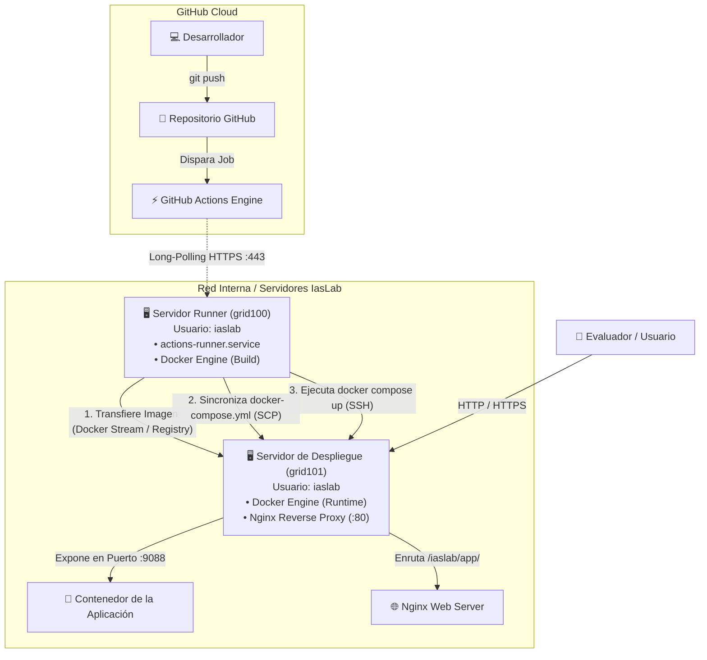

# 📘 Guía Maestra: Configuración de Self-Hosted Runner y Despliegue Remoto de Docker vía SSH

Esta guía documenta paso a paso cómo configurar un **Runner Auto-Hospedado (Self-Hosted Runner)** de GitHub Actions en Linux y cómo utilizarlo para **construir y desplegar contenedores Docker en un servidor remoto independiente** mediante conexiones seguras por SSH.

---

## 🗺️ 1. Arquitectura de Despliegue Remoto

En entornos de infraestructura profesional y laboratorios (como **IasLab**), el nodo que ejecuta el Runner no suele ser el mismo que aloja las aplicaciones de producción o pruebas finales:



### ¿Por qué separar el Runner del Servidor de Despliegue?
1. **Aislamiento de Cargas:** Las compilaciones pesadas (Maven, Gradle, Webpack, Docker builds) no consumen la CPU/RAM del servidor de aplicaciones.
2. **Seguridad:** Si el runner se ve comprometido por una dependencia maliciosa, no tiene acceso root directo al servidor de aplicaciones.
3. **Escalabilidad Multihost:** Un único runner puede orquestar despliegues hacia múltiples servidores (`grid100`, `grid101`, `grid102`, `205m01`, etc.).

---

## ⚙️ 2. Configuración del Self-Hosted Runner en Linux (Ej. en `grid100`)

### 2.1 Requisitos Previos en el Servidor del Runner
- Sistema Operativo: Ubuntu / Debian Linux x64.
- Paquetes esenciales instalados: `curl`, `tar`, `git`, `libicu-dev`, `docker.io`, `docker-compose-v2`.
- Usuario dedicado con permisos de Docker:
  ```bash
  # Crear usuario iaslab si no existe y agregarlo al grupo docker
  sudo usermod -aG docker iaslab
  ```

### 2.2 Descarga e Instalación del Runner
Conéctate al servidor que actuará como Runner (`grid100`):

```bash
# 1. Crear carpeta de instalación en el home del usuario
mkdir -p /home/iaslab/github-runner && cd /home/iaslab/github-runner

# 2. Descargar la versión más reciente del Runner oficial de GitHub
curl -o actions-runner-linux-x64-2.336.0.tar.gz -L https://github.com/actions/runner/releases/download/v2.336.0/actions-runner-linux-x64-2.336.0.tar.gz

# 3. Extraer el paquete
tar xzf ./actions-runner-linux-x64-2.336.0.tar.gz

# 4. Instalar dependencias del sistema requeridas por .NET Core
sudo ./bin/installdependencies.sh
```

### 2.3 Registro y Vinculación con el Repositorio
1. En GitHub, dirígete a tu repositorio: **Settings** ➔ **Actions** ➔ **Runners** ➔ **New self-hosted runner**.
2. Copia el token de registro de 29 caracteres proporcionado por GitHub.
3. Ejecuta la configuración:
   ```bash
   ./config.sh --url https://github.com/TU_USUARIO/TU_REPOSITORIO \
               --token TU_TOKEN_DE_REGISTRO \
               --name grid100-runner \
               --labels self-hosted,linux,x64,grid100 \
               --work _work \
               --unattended \
               --replace
   ```

### 2.4 Instalación como Servicio Persistente Systemd
Para que el runner se ejecute automáticamente tras reinicios y no se cierre al salir de la terminal:

```bash
# Instalar el servicio systemd bajo el usuario iaslab
sudo ./svc.sh install iaslab

# Iniciar el servicio
sudo ./svc.sh start

# Verificar estado
sudo ./svc.sh status
```

> [!IMPORTANT]
> **¿Por qué el Runner NO requiere puertos abiertos hacia Internet?**
> El servicio `actions-runner` utiliza una **conexión saliente continua (*Outbound Long-Polling / WebSockets*)** por el puerto HTTPS `443` hacia los servidores de GitHub. El runner consulta periódicamente si hay tareas pendientes, descarga el payload y envía los resultados de vuelta sin requerir IPs públicas, redirecciones en routers ni abrir puertos en el firewall.

---

## 🔑 3. Configuración de Claves SSH entre Runner y Servidor de Despliegue

Para que el Runner (`grid100`) pueda ejecutar comandos en el servidor de destino (`grid101`) sin pedir contraseñas interactivas, se debe configurar autenticación por par de claves SSH.

```
+------------------------+                              +------------------------+
|  Servidor Runner       |                              |  Servidor de Destino   |
|  (grid100 - iaslab)    |                              |  (grid101 - iaslab)    |
|                        |                              |                        |
|  ~/.ssh/id_ed25519 ----+------- Clave Pública ------->|  ~/.ssh/authorized_keys|
|  (Clave Privada)       |    (ssh-copy-id grid101)     |                        |
+------------------------+                              +------------------------+
```

### Paso 1: Generar el par de claves en el Servidor Runner (`grid100`)
Inicia sesión en `grid100` con el usuario que ejecuta el runner (`iaslab`):

```bash
# Iniciar sesión como iaslab
ssh iaslab@grid100

# Generar un par de claves Ed25519 (más seguro y rápido que RSA)
ssh-keygen -t ed25519 -C "github-runner@grid100" -f ~/.ssh/id_ed25519 -N ""
```

### Paso 2: Copiar la clave pública al Servidor de Despliegue (`grid101`)
```bash
# Copiar la clave pública a grid101
ssh-copy-id -i ~/.ssh/id_ed25519.pub iaslab@grid101
```
*(Ingresa la contraseña de `iaslab` en `grid101` solo por esta única vez).*

### Paso 3: Configurar permisos estrictos en ambos servidores
SSH rechaza conexiones si los permisos de los archivos de claves son muy abiertos:

**En `grid100` (Runner):**
```bash
chmod 700 ~/.ssh
chmod 600 ~/.ssh/id_ed25519
chmod 644 ~/.ssh/id_ed25519.pub
```

**En `grid101` (Destino):**
```bash
chmod 700 ~/.ssh
chmod 600 ~/.ssh/authorized_keys
```

### Paso 4: Optimizar la configuración de SSH (`~/.ssh/config` en el Runner)
Crea o edita `~/.ssh/config` en el usuario `iaslab` de `grid100`:

```sshconfig
Host grid101
    HostName 192.168.131.11
    User iaslab
    IdentityFile ~/.ssh/id_ed25519
    StrictHostKeyChecking accept-new
    ServerAliveInterval 60
    ServerAliveCountMax 3
```

### Paso 5: Validar la conexión sin contraseña
Desde `grid100`, ejecuta:
```bash
ssh iaslab@grid101 "hostname && docker --version"
```
> Si el comando imprime el nombre del host `grid101` y la versión de Docker sin solicitar contraseña, la configuración SSH es correcta.

---

## 🐳 4. Estrategias para Desplegar la Imagen de Docker en el Servidor Remoto

Existen tres estrategias principales para llevar una imagen compilada desde el Runner hasta el Servidor de Despliegue:

---

### 🌟 Estrategia 1: Vía Streaming Directo SSH (`docker save` + `docker load`)
*Recomendada cuando los servidores están en la misma red local o VPN y no se cuenta con un Docker Registry.*

1. El Runner compila la imagen localmente: `docker build -t mi-app:latest .`
2. El Runner transmite la imagen directamente por SSH comprimida con `gzip`:
   ```bash
   docker save mi-app:latest | gzip -c | ssh iaslab@grid101 "gunzip -c | docker load"
   ```
3. El Runner copia `docker-compose.yml` y arranca el contenedor:
   ```bash
   scp docker-compose.yml iaslab@grid101:/home/iaslab/mi-app/
   ssh iaslab@grid101 "cd /home/iaslab/mi-app && docker compose up -d --force-recreate"
   ```

**Ventajas:**
- No requiere servidor Nexus, Harbor ni Docker Hub.
- Rápido y eficiente en redes LAN Gigabit.
- Las imágenes no salen a internet.

---

### 🏢 Estrategia 2: Vía Docker Registry Centralizado (Nexus / GHCR / Docker Hub)
*Recomendada en entornos de producción con pipelines CI/CD formales.*

1. El Runner compila y publica en el Registry:
   ```bash
   docker build -t 192.168.131.17:9080/mi-app:1.0.0 .
   docker push 192.168.131.17:9080/mi-app:1.0.0
   ```
2. El Runner notifica por SSH al servidor de despliegue para descargar y levantar:
   ```bash
   ssh iaslab@grid101 "cd /home/iaslab/mi-app && docker compose pull && docker compose up -d"
   ```

**Ventajas:**
- Versionado inmutable de imágenes (`1.0.0`, `1.0.1-RC1`).
- Despliegue simultáneo en múltiples nodos con solo un `docker pull`.

---

### 📂 Estrategia 3: Sincronización de Código y Build Remoto
*Recomendada para aplicaciones ligeras donde el servidor de destino tiene capacidad de compilación.*

1. El Runner transfiere los archivos con `rsync`:
   ```bash
   rsync -avz --exclude '.git' . iaslab@grid101:/home/iaslab/mi-app/
   ```
2. El Runner ejecuta la compilación en el servidor remoto:
   ```bash
   ssh iaslab@grid101 "cd /home/iaslab/mi-app && docker compose build && docker compose up -d"
   ```

---

## 🛠️ 5. Implementación en el Proyecto: ¿Script de Despliegue vs Directo en el Workflow?

Puedes implementar el despliegue mediante dos enfoques:

---

### Enfoque A: Mediante un Script de Despliegue (`scripts/remote-deploy.sh`) — ⭐ RECOMENDADO

Crea un script parametrizado dentro de tu repositorio en [`scripts/remote-deploy.sh`](file:///root/work-space/ingesoftV/scripts/remote-deploy.sh):

```bash
#!/usr/bin/env bash
set -euo pipefail

TARGET_HOST="${1:-grid101}"
TARGET_USER="${2:-iaslab}"
DEPLOY_DIR="${3:-/home/iaslab/github-action-remote}"
APP_PORT="${4:-9088}"
IMAGE_NAME="github-action-remote-app:latest"

echo "=== 1. Compilando imagen Docker en el Runner ==="
docker build -t "${IMAGE_NAME}" .

echo "=== 2. Transfiriendo imagen comprimida a ${TARGET_HOST} vía SSH ==="
docker save "${IMAGE_NAME}" | gzip -c | ssh "${TARGET_USER}@${TARGET_HOST}" "gunzip -c | docker load"

echo "=== 3. Sincronizando archivos de despliegue ==="
ssh "${TARGET_USER}@${TARGET_HOST}" "mkdir -p '${DEPLOY_DIR}'"
scp docker-compose.yml nginx.conf "${TARGET_USER}@${TARGET_HOST}:${DEPLOY_DIR}/"
ssh "${TARGET_USER}@${TARGET_HOST}" "chmod -R 755 '${DEPLOY_DIR}'"

echo "=== 4. Levantando contenedores y recargando Nginx en ${TARGET_HOST} ==="
ssh "${TARGET_USER}@${TARGET_HOST}" bash << REMOTE_SCRIPT
    set -euo pipefail
    cd "${DEPLOY_DIR}"
    docker compose down --remove-orphans || true
    docker compose up -d --force-recreate
    sudo nginx -t
    sudo systemctl reload nginx
REMOTE_SCRIPT

echo "=== 5. Healthcheck del servicio en ${TARGET_HOST} ==="
sleep 2
ssh "${TARGET_USER}@${TARGET_HOST}" "curl -sI http://127.0.0.1:${APP_PORT}/ | head -n 5"
echo "✅ Despliegue finalizado exitosamente en ${TARGET_HOST}."
```

#### Invocación desde el Workflow (`.github/workflows/deploy.yml`):
```yaml
name: Remote Deploy via Script

on:
  push:
    branches: [ main ]

jobs:
  deploy:
    runs-on: [ self-hosted ]
    steps:
      - uses: actions/checkout@v4
      - name: Ejecutar Despliegue Remoto
        run: |
          chmod +x ./scripts/remote-deploy.sh
          ./scripts/remote-deploy.sh grid101 iaslab /home/iaslab/github-action-remote 9088
```

---

### Enfoque B: Pasos Directos (Inline) en el Archivo del Workflow YAML

Si prefieres no mantener un script bash separado, puedes codificar los pasos directamente en el workflow [`.github/workflows/deploy-remote.yml`](file:///root/work-space/ingesoftV/.github/workflows/deploy-remote.yml):

```yaml
name: Deploy Inline to Remote Server

on:
  push:
    branches: [ main ]

jobs:
  deploy-remote:
    name: Despliegue Remoto en grid101
    runs-on: [ self-hosted ]
    steps:
      - name: Checkout Código
        uses: actions/checkout@v4

      - name: 1. Compilar Imagen en el Runner
        run: docker build -t mi-app:latest .

      - name: 2. Transferir Imagen por Streaming SSH
        run: |
          docker save mi-app:latest | gzip -c | ssh iaslab@grid101 "gunzip -c | docker load"

      - name: 3. Copiar docker-compose y Nginx
        run: |
          ssh iaslab@grid101 "mkdir -p /home/iaslab/mi-app"
          scp docker-compose.yml nginx.conf iaslab@grid101:/home/iaslab/mi-app/
          ssh iaslab@grid101 "chmod -R 755 /home/iaslab/mi-app"

      - name: 4. Ejecutar Contenedor en Destino
        run: |
          ssh iaslab@grid101 << 'EOF'
            set -euo pipefail
            cd /home/iaslab/mi-app
            docker compose down --remove-orphans || true
            docker compose up -d --force-recreate
            sudo nginx -t && sudo systemctl reload nginx
          EOF

      - name: 5. Verificación de Salud (Healthcheck)
        run: |
          sleep 2
          ssh iaslab@grid101 "curl -sI http://127.0.0.1:9088/ | grep 'HTTP/1.1 200'"
```

---

## 📋 6. Checklist de Configuraciones en Servidor Destino (`grid101`)

Antes de lanzar el pipeline de despliegue remoto, asegúrate de que el servidor de destino (`grid101`) tenga configurado lo siguiente:

1. [ ] **Usuario con acceso a Docker:**
   ```bash
   sudo usermod -aG docker iaslab
   ```
2. [ ] **Clave SSH pública autorizada:**
   ```bash
   # Verificable en ~/.ssh/authorized_keys de grid101
   grep "github-runner@grid100" ~/.ssh/authorized_keys
   ```
3. [ ] **Sudo sin contraseña para recargar Nginx:**
   ```bash
   # En /etc/sudoers.d/iaslab de grid101:
   echo "iaslab ALL=(ALL) NOPASSWD: /usr/sbin/nginx, /usr/bin/systemctl reload nginx" | sudo tee /etc/sudoers.d/iaslab
   sudo chmod 0440 /etc/sudoers.d/iaslab
   ```
4. [ ] **Nginx maestro configurado para incluir sitios de usuario:**
   ```nginx
   # En /etc/nginx/sites-available/default de grid101:
   include /home/iaslab/*/nginx.conf;
   ```

---

## 🎯 7. Resumen de Comandos Rápidos

| Tarea | Comando en Runner (`grid100`) |
| :--- | :--- |
| **Generar Clave SSH** | `ssh-keygen -t ed25519 -C "runner@grid100" -f ~/.ssh/id_ed25519 -N ""` |
| **Copiar Clave a Destino** | `ssh-copy-id -i ~/.ssh/id_ed25519.pub iaslab@grid101` |
| **Probar Conexión SSH** | `ssh iaslab@grid101 "hostname && docker ps"` |
| **Transferir Imagen Docker**| `docker save app:tag \| gzip -c \| ssh iaslab@grid101 "gunzip -c \| docker load"` |
| **Copiar Configuraciones** | `scp docker-compose.yml nginx.conf iaslab@grid101:/home/iaslab/app/` |
| **Ejecutar Despliegue** | `ssh iaslab@grid101 "cd /home/iaslab/app && docker compose up -d"` |
